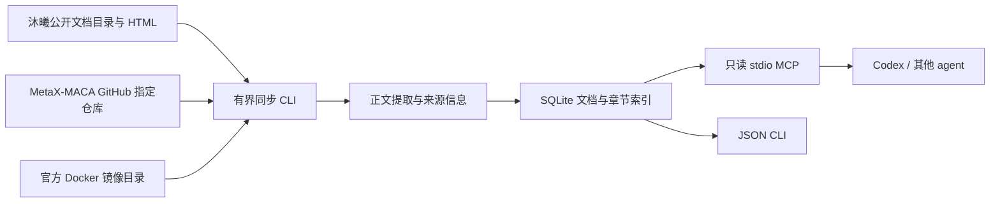

# metax-docs-mcp 方案与验收标准

## 目标和范围
为 Codex、Claude Code、Cursor 等支持 stdio MCP 的 agent 提供统一、可追溯的沐曦资料检索。第一版覆盖公开官方 HTML 文档，MetaX-MACA 组织内所选仓库的 README、Markdown/RST 文档，以及官方 Docker 镜像目录元数据；代码索引可选。登录资料、PDF OCR、issues/PR 和向量检索不在首版范围。文档与代码分别标记来源，不能把某个仓库的实现自动当成所有 MACA 版本的规范。

## 数据流

同步进程负责联网；MCP 服务只查询本地数据。这样工具调用的延迟、输出大小与外部站点可用性解耦，用户也能检查实际收录范围。无需 embedding 服务、API 费用或向量数据库。使用官方 Python MCP SDK，依赖锁文件保证可复现；当前实现固定 v1 兼容线，升级 v2 应单独做协议回归。

## 来源与更新语义

每条记录包含稳定 ID、来源、标题、原始 URL、版本、仓库、路径、commit、抓取时间、正文与元数据。GitHub 内容通过同一固定 commit 的 tree 和 raw URL 读取，引用采用 commit URL。官方无法识别版本时保持未知，不能用抓取时间代替产品版本。

内容 hash 负责幂等写入；再次同步会刷新观察时间。首版保留历史已收录项，不因有界爬取或网络失败而删除记录。因此 sources 是本地索引覆盖清单，不是源站当前完整镜像；要清理源端删除项应使用新数据库重新同步。网络失败、页数/文件数上限和目录未遍历完必须显式报告，不能宣称全量同步完成。

## 查询契约

- `search_metax_docs`：统一检索，按 source、repository、version 过滤，返回摘要和可引用来源。
- `get_metax_document`：按 ID 分页读取正文，并返回来源信息。
- `get_metax_section`：读取相关章节，避免整本手册消耗上下文。
- `list_metax_sources`：核实本地数据库收录情况及时间。

技术 token 与中文都需要检索测试；相关性是词法检索，不能保证长自然语言问题的语义召回。agent 应先用具体 API、命令、错误串和产品名检索，再读完整章节，最后引用 URL。不同版本的命中应分开解释。

## 边界

公开 HTTPS allowlist、受限重定向、超时、有限重试、响应大小和采集数量限制。GitHub token 仅由环境变量提供，不落盘，不出现在输出中。MCP 不提供执行命令或网络写入工具。网页、README、代码注释均是检索数据，其中的指令不应获得系统提示优先级。源内容保留原站许可；本项目不把抓取语料作为代码包的一部分发布。

## 阶段门禁

1. 来源可达与契约：验证官方 HTML/目录和 GitHub API 的真实公开请求；确定跨模块数据与工具签名。
2. 模块：核心索引、双源采集、CLI/MCP 各自自动测试；输入过滤、大小限制、故障可见性纳入测试。
3. 集成：从两个真实源抓取小样本，按来源检索并回读，重复同步验证幂等；完成 MCP initialize、tools/list、tools/call。
4. 交付：README 可复现安装/同步/接入，锁文件、离线测试和实际验收记录；明确覆盖上限，不把 smoke test 写成全站覆盖。

## 后续扩展

优先做更新状态持久化、ETag/条件请求、完整同步后的删除核对、检索评测集；规模与召回确有需要时再增加混合向量检索。远程多用户服务应单独增加认证、权限与配额，不直接把本地 stdio 暴露到公网。

## 首版运行默认值

本地运行、无需用户账号、GitHub 选择 `maca-samples` 作为开箱样本。仓库列表与官方页数可在 JSON 配置中扩展。每次同步结果是当次执行报告；`sources` 查询反映累计索引，不替代同步报告。后续需要跨团队共享时，优先共享安装包/配置并让各客户端建立本地索引，再评估托管 HTTP MCP。

## 镜像目录扩展

镜像元数据作为 `source=docker`，与手册和 GitHub 一起检索。默认范围遵循用户给定页面的 C500、MXMACA、docker、分层包过滤。只索引公开镜像说明与拉取命令；不登录仓库、不执行 docker pull。字段以官方响应为准，缺失兼容性信息不自行推断。
